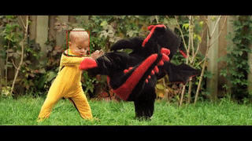

# VOT_SIAMRPN
The task for Video Object Tracking could be defined as tracking an object of interest throughout the video sequence. The object of interest is given by a bounding box around it in the first frame. In successive frames, the object could undergo various changes such as shape, size, occluded, deformation, motion, etc. The Siamese-based tracker uses siamese architecture to calculate the similarity between the template from the first frame and patches in the current frame. Once the siamese network has given the representation of the current frame patches and template we apply RPN on it to get object proposals. Finally, regressor and classifier are applied to get final box predictions.

In standard RPN, it looks for the "objects which are in the dataset", but what to look at here because there are infinite objects
that we could be tracking, so it needs the "objectness" information which is provided by the template branch.

The paper is High Performance Visual Tracking with Siamese Region Proposal Network, but this implementation is different from it, as I have used SSD-like loss function.

# SIAMESE Network
It is important to have a translationally invariant network here, and therefore Alexnet without padding (because padding produces boundary effect, which in turn generates central bias) is used. I have not used the pre-trained version of it because weights were higher and gradient exploding was happening.

# RPN Network
The RPN network has 4 small CNNs for each template and patch for both regression and classification. We have used 5 aspect ratios and a network stride of 8.
One issue is because template CNN has 2*5*256 and 4*5*256 channels it leads to massive growth in the number of parameters, which leads to difficult optimization. One way is to use Channel wise convolution than the normal convolution.

# Model
I have trained it on OTB-15 dataset and checked its performance on the separately kept validation dataset.
Please check the notebook for model implementation, and results.

# Results
Red bb is prediction, green bb is ground truth.

## Training

## Validation
sorted in order from best to worst

